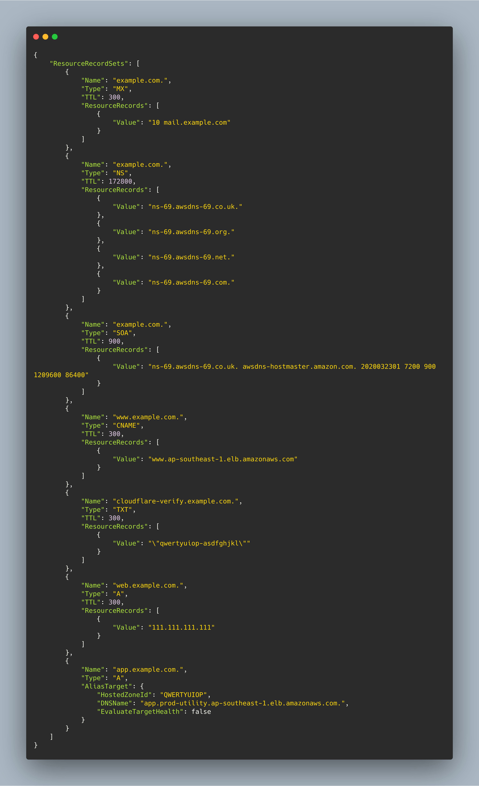
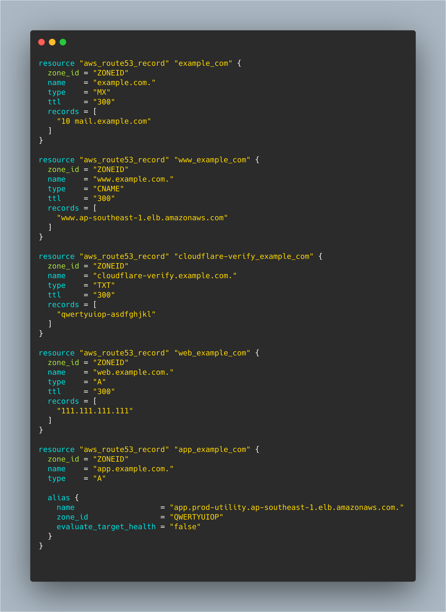

# Route53 To TF
This tool is to convert your route53 JSON output  from below AWS CLI command to terraform resource.

```
aws route53 list-resource-record-sets --hosted-zone-id hosted-zone-id > path-to-output-file
```

## Command Arguments

```
route53-to-tf -h

Usage of route53-to-tf:
  -o, --output string   output file path
  -s, --source string   source file path
```

If you don't specify the output it will be written in `output.tf` file in current directory.

## Run

```
go run cmd/route53-to-tf/route53-to-tf.go -s example/source.json -o output/output.tf
```

## Install
If you want to install globally just run go install command.

```
go install cmd/route53-to-tf/route53-to-tf.go
```

After that just run `route53-to-tf` command.

## Gallery

### Before



### After

